This repository contains scripts and notes from my internship with the Molecular Systems Evolution research group of Prof. J. Dutheil at the Max Planck Institute for evolutionary Biology in spring 2025.

# Population structure

## Initial questions
- Create a genome alignment of Synechococcus genomes to find out if they can be considered a population. 
- Investiage linkage equilibrium/ independent/non-independent recombination
- Are there geographic groups? Separate dataset and use groups to invesitage adaptive evolution.

## Steps
Full protocol is on [gitlab](https://gitlab.gwdg.de/molsysevol/staphylococcus-zins-evolution)!

### Initial guide tree with Andi
get it from [apt](https://github.com/evolbioinf/andi/)

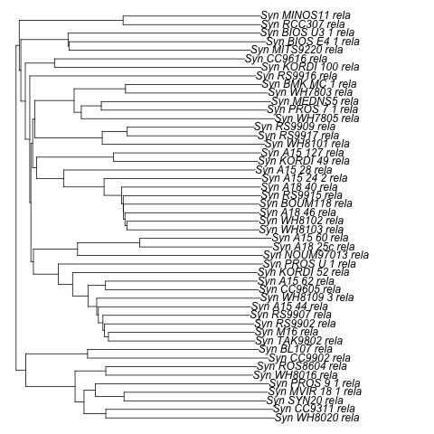

### Genome alignment with Cactus
was installed on MPI server; tried to install myself with little success

### Filter genome alignment to remove ambigous regions with MafFilter
install Bio++ libraries:  bpp-core, bpp-seq, bpp-phyl, bpp-popgen, bpp-suite and maffilter from git repos

### Reconstruct phylogeny with MafFilter and Aster
install [aster](https://github.com/chaoszhang/ASTER)

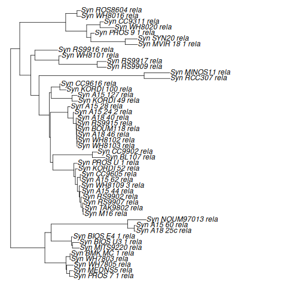
### Realign genome with cactus and new tree

### Refilter alignment

### Re-reconstruct phylogenies
Compare r1 and r2 trees using phylo.io

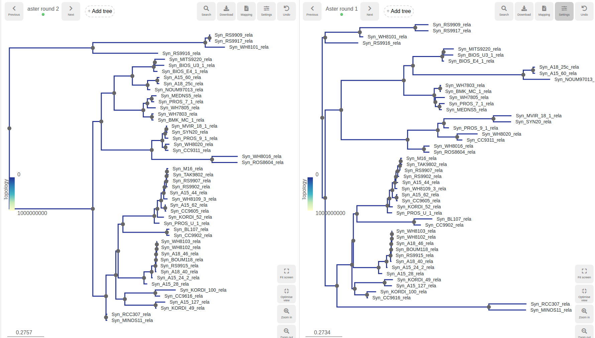

### Plot tree vs environmental information
Genome alignment tree reproduces published phylogeny fairily well, no obvious connection between phylogeny, temperature or geography

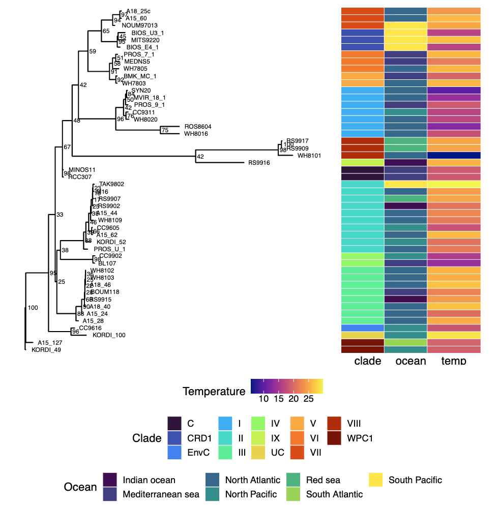 

### Establish possible populations
Add supports with bpp consense > pick 2 possible populations with low internal support values:

- POP1:WH8102 to A1840 , 8 members
- POP2:TAK9802 to PROS_U_1 , 10 members

### Create VCF files with SNPs for each population

### Calculate linkage equilibrium decay

Install BCFtools, VCFtools
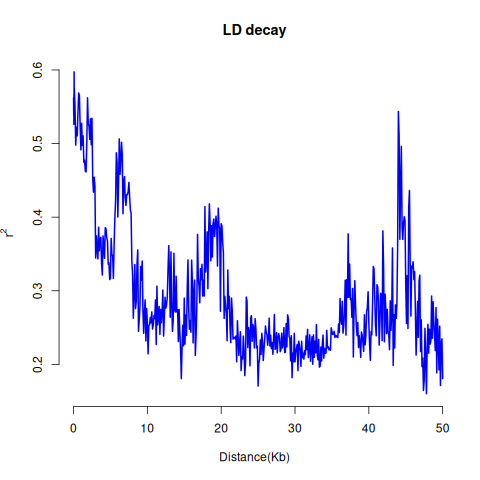  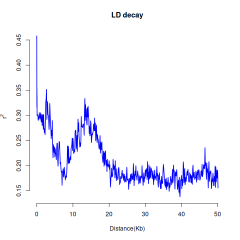

at 25kB is the point at which the decline becomes minimal = distance at which 2 SNPs in the genome can be considered independent (= no linkage) and are informative for population genomics methods

### Assess population structure with plink and smartPCA

keep only biallelic SNPs that are independent based on LD -> PLINK -> smartPCA

- POPULATION 1
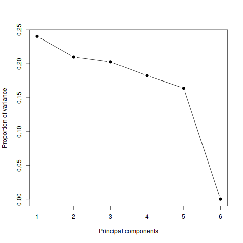
  
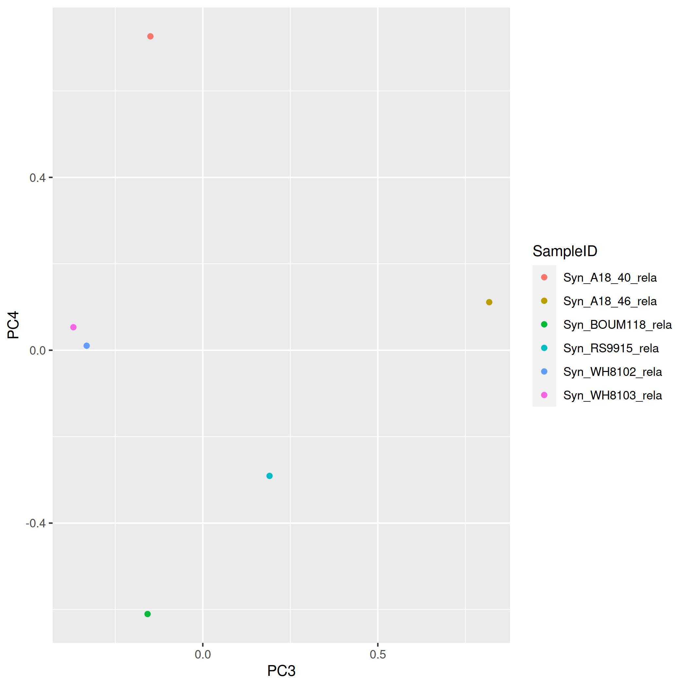  
pop1 PCA2 seems to correlate with ocean of origin

- POPULATION 2
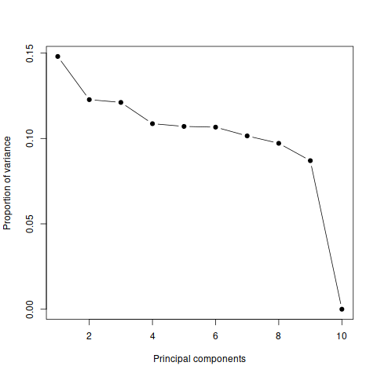
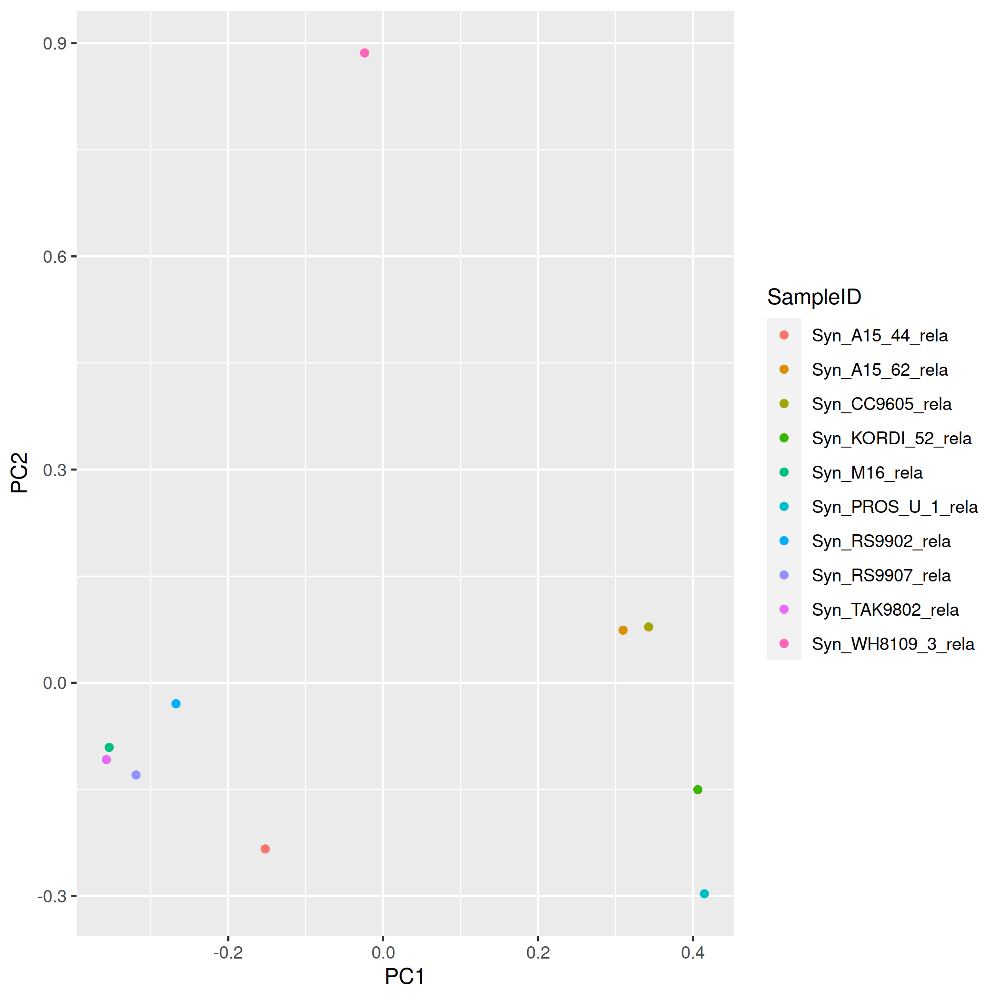
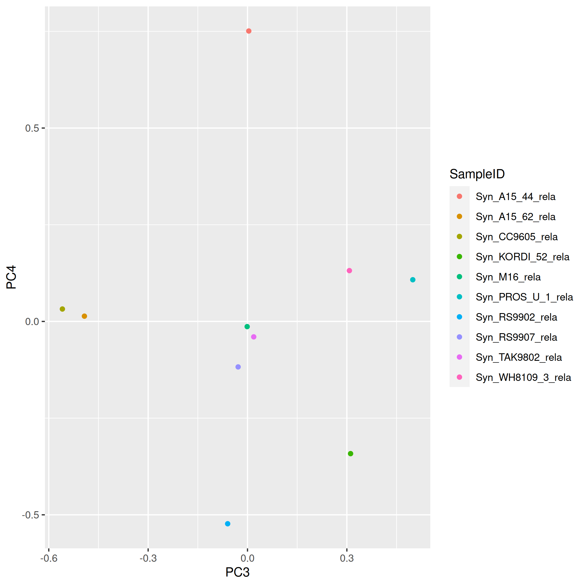

Pop2 PCA 1 = phylogeny

### Run admixture to prove most likely each dataset is 1 population

In both cases, case 1 population is most likely

# Distribution of fitness effects

## Initial questions
- what is the rate of adaptive mutations
- apply phylostratigraphy approaches to get a measure of gene age for shared parameter estimation
- use [FastDFE](https://fastdfe.readthedocs.io/en/latest/reference/Python/inference.html)

## Steps
### Repeat alignments for population with an OUTGROUP (BL107) to get "polarized SNPs"
### Run Fast DFE

- SFS: Site frequency spectrum
    - related to the SNPs; how common they are across the different input species
    - selected = nonsynonymous sites
    - neutral = synonymous sites
- Parameter estimates = probability distribution of the selection coefficients of mutations at selected sites
    - Sb:  average (population-scaled) strength of  beneficial mutations
    - Sd: average (population-scaled) strength of deleterious mutations
    - pb: probability of a mutation being beneficial
    - e:  ancestral misidentification parameter
    - b: shape of the gamma distribution
- Function  a: expected proportion of beneficial nonsynonymous substitutions

Population 1:

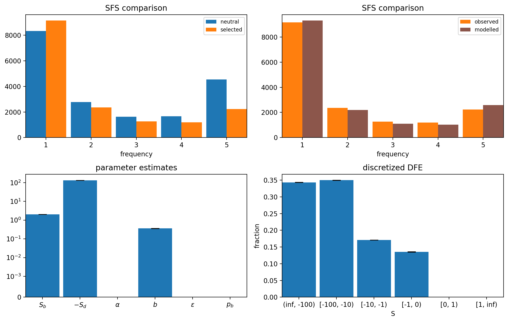

PB=0 --> probability of benefitial mutation =0. Pop1 is unsuitable

Population 2: 

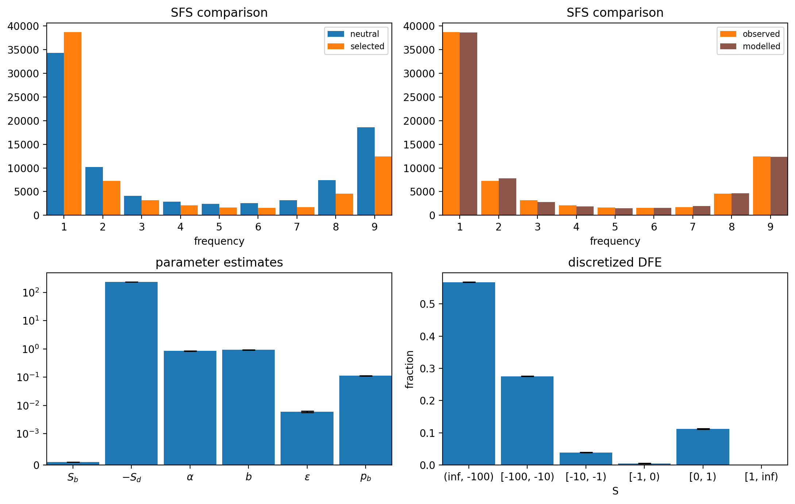

More suitable parameters for further investigations! Very weak benefitial mutations?

### Run DIAMOND blast on mapping genome CC9605

- Installing diamond is easy
- Blast DB download keeps being corrupted; worked on 4th attempt
- Idea: exclude Cyanobacteria from hits, give minimal E parameter >>  genes that are in the outputfile are older then speciation of synechococcus
    - Problem: ca 1/10 hits is not completely annotated; only has an ID but no organism info

- Rerun w NCBI blast 
    - even less annotation beyond id

- Run Diamond blast wo exclusion critera

### Split genome in genes older/younger then cyanobacteria speciation

- parse w python script genes that have only annotation in cyanobacteria <> rest

 

Small difference in the estimated parameters (Sd) can be observed > repeat with more strata!

### Initial attempt at shared parameter estimation 
- misstake in the phylogeny; should repeat the categorisation!
- possible misstakes in running fastDFE; WIP

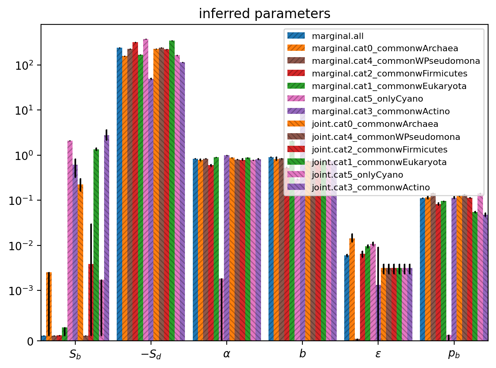